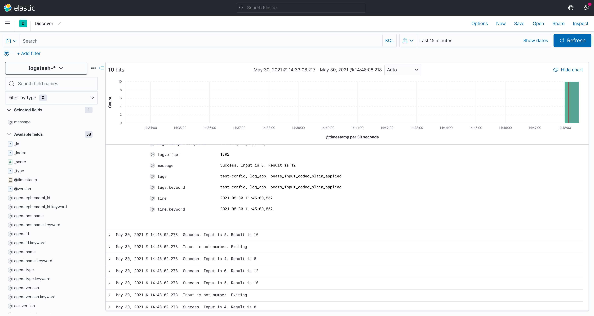
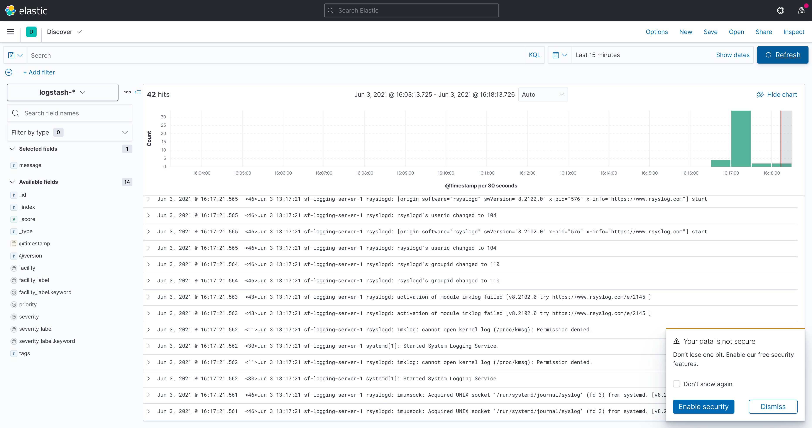

# SkillFactory: DEVOPS. Практикум. Модуль 24. Журналирование

## Задание 24.9.1

Разверните на Server2 Elasticsearch+Kibana. Настройте визуализацию логов Kibana на ней самой.

## Задание 24.9.2

Напишите приложение (на удобном для вас языке программирования), получающее на вход число, а на выходе выдающее это число удвоенным.

Примените библиотеку журналирования, которая будет записывать в лог дату, время и введенное число. Лог должен быть в JSON-формате.

## Задание 24.9.3 

1. Настройте на Server1 с помощью RSyslog отправку логов из п. 2 в Elasticsearch на Server2.
1. Проверьте через Kibana, что логи доставляются (в пункте Discover).

Для проверки пришлите ментору скриншот с логами вашего приложения из Kibana.

## Решение

Для решения задачи создан плейбук, который создает два контейнера и производит необходимые настройки

- ELK устанавливается и настраивается в ролях elk_repo, elk_server
- приложение устанавливается в роли log_app, исходный доступен в roles/log_app/files/log_app.py 
- отправка логов с помощью rsyslog доступна в роли rsyslog_client

## Скриншоты

